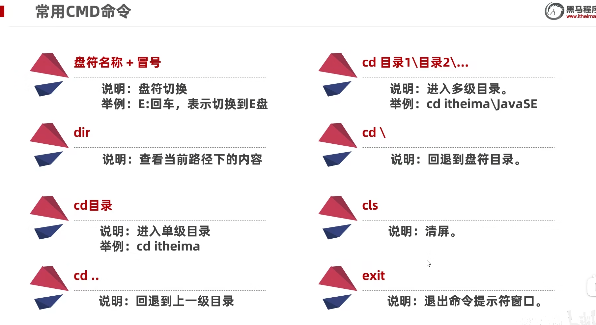

# Java基础学习

## 学习连接

1 [黑马程序员Java零基础视频教程_上部(Java入门，含斯坦福大学练习题+力扣算法](https://www.bilibili.com/video/BV17F411T7Ao?spm_id_from=333.788.videopod.episodes&vd_source=0a0dd058ef849bffba564af91a70780d&p=3)

## 1 Java基础

### 1.1 CMD介绍[视频p3-4 Java入门-04-常见的CMD命令]

1 打开

> win + R命令  
>
> 输入cmd，回车

2 常见命令  
